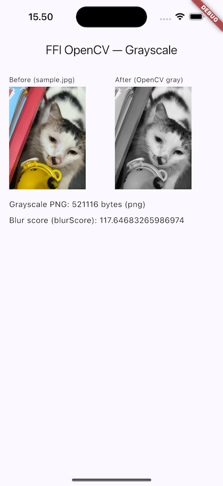

# flutter_ffi_opencv

Flutter ↔ OpenCV over **hand-written `dart:ffi`**, behind a clean layered architecture with a **provable native boundary** — **one FFI boundary + one shared C++ implementation, running on both Android and iOS**.

The point of this repo is the native boundary done correctly — memory ownership, isolate offloading, and the confinement of `dart:ffi` to a known surface — not "an app that converts an image to grayscale." Two real OpenCV operations (grayscale and a Laplacian-variance blur score) exercise the boundary end to end; the operations are the demo, the boundary is the point.

> Scope: **Android and iOS**, both driven from a single shared C++ source (`native/native_opencv.cpp`) through one hand-written FFI boundary. iOS is verified on the **arm64 simulator** with real OpenCV (grayscale + blur, byte-identical to Android — same C++); the one remaining item is device + release builds, which need a Runner Strip Style setting that isn't wired yet ([flutter#62666](https://github.com/flutter/flutter/issues/62666)). See [Current scope](#current-scope--roadmap).

<table>
  <tr>
    <td align="center" width="50%">
      
      <br><sub><b>Android</b></sub>
    </td>
    <td align="center" width="50%">
      
      <br><sub><b>iOS (simulator)</b></sub>
    </td>
  </tr>
</table>

---

## Two executable proofs

The architectural claims here are not prose — a reviewer can run them.

### 1. The `dart:ffi` boundary is enforced, not asserted

`dart:ffi` is imported in **exactly two locations**: `lib/core/native/` and the single FFI data source `lib/features/image_processing/data/datasources/opencv_ffi_datasource.dart`. Domain, repository, and presentation never see a `Pointer`. A one-command CI check fails the build if that ever leaks:

```bash
$ bash tool/check_ffi_boundary.sh
✅ dart:ffi is confined to core/native/ and the FFI data source.
```

The script greps for the `import 'dart:ffi'` **directive** (not the bare string, so comments documenting the rule don't trip it) and fails if any file outside the two allowed locations imports it.

### 2. Everything above the boundary is tested with no device and no `.so`

Because `dart:ffi` is confined, the entire error-mapping and `Either` plumbing is unit-testable on the Dart VM. The data source's abstract interface is mocked (mocktail); no emulator, no native library:

```bash
$ flutter test
00:00 +0: toGrayscale (image path) maps datasource bytes -> Right(ProcessedImage)
00:00 +1: toGrayscale (image path) OpenCvException(-1) -> DecodeFailure
00:00 +2: toGrayscale (image path) OpenCvException(-2) -> InvalidInputFailure
   ...
00:00 +11: All tests passed!
```

This **unit-vs-integration split is the payoff** of confining `dart:ffi`: the logic (status→`Failure` mapping, `Either` folding, both return shapes) is verified device-free; only the FFI *mechanism* itself needs a device.

---

## Architecture

Standard Clean Architecture layering, with the FFI boundary made explicit. `Uint8List` (pure `dart:typed_data`, no native lifetime) is allowed everywhere; `Pointer`/`dart:ffi` is not.

```
presentation/   GrayscalePage · GrayscaleController / BlurScoreController
                (AsyncNotifier folds Either -> AsyncValue.when)
      │ watches
providers/      Provider DI chain, typed to ABSTRACT interfaces
      │
domain/         ProcessedImage · ImageMetric          (Equatable, pure Dart)
                ImageProcessingRepository              (abstract interface)
                ConvertToGrayscale · ComputeBlurScore  (UseCase<T, Params>)
      │ Either<Failure, T>
data/           ImageProcessingRepositoryImpl
                (maps OpenCvException.status -> Failure)            ── no dart:ffi
      │ throws OpenCvException
══════════════ dart:ffi BOUNDARY — enforced by tool/check_ffi_boundary.sh ══════════════
data/datasources/  OpenCvFfiDataSource    Isolate.run + malloc/free + the native call
core/native/       OpenCvBindings (DynamicLibrary loader) · OpenCvResult (Struct)
                   OpenCvStatus (pure-Dart status mirror, no ffi)
      │ FFI
native (C++)    one shared native_opencv.cpp  ->  libnative_opencv.so (Android)
                                            \->  native_opencv.framework (iOS)
                opencv_process() / opencv_free_buffer()  ->  OpenCV
```

Actual folder structure under `lib/`:

```
core/
  error/      failures.dart · failure_codes.dart · exceptions.dart
  native/     opencv_native.dart · opencv_result.dart · opencv_status.dart   ← ffi boundary (1 of 2)
  usecases/   usecase.dart
features/image_processing/
  data/
    datasources/    opencv_ffi_datasource.dart                               ← ffi boundary (2 of 2)
    models/         processed_image_model.dart
    repositories/   image_processing_repository_impl.dart
  domain/
    entities/       processed_image.dart · image_metric.dart
    repositories/   image_processing_repository.dart
    usecases/       convert_to_grayscale.dart · compute_blur_score.dart · image_bytes_params.dart
  providers/        image_processing_providers.dart
  presentation/
    pages/          grayscale_page.dart
    providers/      grayscale_controller.dart · blur_score_controller.dart
main.dart
```

- **Failures** are a `sealed` Equatable hierarchy with an optional machine-readable `code` (`FailureCode`); results flow as `Either<Failure, T>` (fpdart). State is exposed via Riverpod `AsyncNotifier`s that fold the `Either`. Manual `Equatable`, no freezed, no code generation.

---

## The native boundary design

The parts a reviewer cares about — each is reflected directly in `android/app/src/main/cpp/native_opencv.h` and `lib/core/native/` + the data source.

**Out-pointer result, not struct-by-value.** `opencv_process` returns an `int32` status and writes its payload into a **caller-owned** `OpenCvResult*`:

```c
int32_t opencv_process(const uint8_t* input, int32_t input_len,
                       int32_t op_code, OpenCvResult* out);
void    opencv_free_buffer(uint8_t* data);
```

Returning a mixed `int/pointer/double` struct *by value* is the fragile AArch64 ABI corner where register-vs-memory return classification is subtle; a misclassification is silent on-device corruption, not a compile error. The out-pointer (a primitive `int32` return + a caller-owned struct) sidesteps the entire question.

**Whoever allocates, frees.** Two allocators are in play (Dart's `malloc` and C++'s allocator) and they are never crossed:

- Dart allocates the **input buffer** and the **`OpenCvResult` struct**, and frees both in a `try/finally` on every path.
- C++ allocates **`out->data`**; Dart copies the bytes into a Dart-owned `Uint8List`, then calls **`opencv_free_buffer`** so the C++ allocator frees what it allocated.

**Single entrypoint + `op_code`, carrying two return shapes through one mechanism.** Image ops fill `data`/`data_len`; scalar ops fill `scalar` and leave `data == NULL`. The struct has **no `status` field** — the return value is the single source of truth, so it can't drift. Grayscale returns an image buffer; blur score returns a `double` — same plumbing, one switch.

**Isolate offloading with a hard boundary.** Each call runs the native work in `Isolate.run`. A `Pointer` or `DynamicLibrary` handle **cannot cross an isolate boundary** — only transferable Dart values do. The worker closure is given a plain `Uint8List` + `int op_code`; *inside* the worker it opens the library, allocates, calls, copies the result into a `Uint8List`/`double`, and frees everything before returning. The worker functions are **top-level** (not instance methods), so `this` can't be captured even by accident — the no-handle-crosses guarantee is structural, not a matter of discipline. Per-call offload is accepted because the operations are user-initiated and infrequent; the method signature is the seam for a persistent worker later.

**One loader, two platforms — both live and tested.** `_open()` in `lib/core/native/opencv_native.dart` branches on the OS, and **both branches are exercised by the on-device integration test** (Android emulator + arm64 iOS simulator):

- **Android** ships the FFI symbols in a standalone `libnative_opencv.so`, loaded by name with `DynamicLibrary.open('libnative_opencv.so')`.
- **iOS** has no standalone `.so` to open (and forbids `dlopen` of arbitrary paths). Under `use_frameworks!`, the `native_opencv` pod builds as a **dynamic framework** (with OpenCV `-force_load`ed in statically), and its symbols live in the running process's global symbol table — so the loader uses `DynamicLibrary.process()` to resolve them. (A static-lib pod would instead need `DynamicLibrary.executable()`; the dynamic-framework packaging is why `.process()` is the correct call here.)

The platform split is a build-and-load concern only — the C++ above it (`native/native_opencv.cpp`) and every Dart layer are identical across both.

**Hand-written bindings, not ffigen.** The contract is two symbols and one struct. Hand-writing the `lookupFunction` typedefs keeps the actual binding visible in the repo and removes the ffigen + libclang toolchain step for zero benefit at this size. (ffigen would earn its place on a large or churning header.)

**Status → `Failure` mapping** (in `ImageProcessingRepositoryImpl`, above the boundary):

| native / Dart-side status | `Failure` |
|---|---|
| `-1` decode | `DecodeFailure` |
| `-2` invalid input | `InvalidInputFailure` |
| `-3` encode | `EncodeFailure` |
| `-4` unknown op | `UnsupportedOperationFailure` |
| `-99` native exception | `NativeFailure` |
| `-100` malloc failed *(Dart-side)* | `MemoryFailure` |
| `-101` OK-but-null-data *(Dart-side)* | `NativeFailure` |

The native side wraps all `cv::` calls in `try/catch` so an OpenCV exception becomes a status code and never unwinds across the FFI boundary.

---

## Build & run

Both targets compile the **same** shared C++ (`native/native_opencv.cpp`) — Android via CMake, iOS via a CocoaPods dev pod. The OpenCV binary is gitignored on both and resolved the same way (explicit flag/env → in-repo default).

### Android (arm64)

Requires the Flutter SDK (Dart ≥ 3.12) and the Android toolchain (SDK + NDK).

#### Provision the OpenCV Android SDK (not committed)

The OpenCV Android SDK is hundreds of MB and is **gitignored** (`third_party/opencv-android-sdk/`). Provide it one of three ways — the CMake build resolves `OPENCV_DIR` in this order:

1. **`-DOPENCV_DIR=<sdk>/sdk/native/jni`** passed explicitly, else
2. the **`OPENCV_DIR` environment variable**, else
3. the **in-repo default**: `third_party/opencv-android-sdk/sdk/native/jni`.

The simplest path is the default: download the OpenCV Android SDK (tested with **4.12.0**) from [opencv.org/releases](https://opencv.org/releases/) and unpack it so that this file exists:

```
third_party/opencv-android-sdk/sdk/native/jni/OpenCVConfig.cmake
```

If the SDK is missing, CMake fails loudly with the exact path it tried (not a generic `find_package` error).

#### Run

```bash
flutter pub get
flutter run                 # on a connected arm64 device or emulator
```

What the build does (see `android/app/src/main/cpp/CMakeLists.txt` and `android/app/build.gradle.kts`):

- Gradle passes `-DWITH_OPENCV=ON`; the native library `libnative_opencv.so` is built via CMake.
- OpenCV is linked **statically**, only `core`, `imgproc`, `imgcodecs` (not `libopencv_java4.so`), with `-ffunction-sections`/`-fdata-sections` + `--gc-sections` dead-stripping.
- ABI is **arm64-v8a only** (covers physical arm64 devices and Apple-Silicon emulators), filtered at both the CMake build and the APK packaging steps.

A bundled `assets/sample.jpg` is the input image for the demo screen.

### iOS (arm64 simulator)

Requires the Flutter SDK, Xcode + CocoaPods, and an **arm64 iOS simulator** (Apple Silicon). Verified on the simulator; device + release builds are pending one stripping setting (noted below).

#### Provision the OpenCV iOS xcframework (not committed)

iOS links a from-source **`opencv2.xcframework`** — **not** the prebuilt OpenCV iOS fat framework. The prebuilt one ships a device slice plus an **x86_64-only** simulator slice; it has **no arm64-simulator slice**, so it will not link for the demo on an Apple-Silicon Mac (which runs an arm64 simulator). Building from source lets you produce the arm64-simulator slice the M-series simulator needs.

Like the Android SDK, the xcframework is **gitignored** (`third_party/opencv-ios/`) and resolved by `native_opencv.podspec` in this order:

1. the **`OPENCV_IOS_DIR` environment variable** (must contain `opencv2.xcframework`), else
2. the **in-repo default**: `third_party/opencv-ios/opencv2.xcframework`.

If it's missing, `pod install` fails loudly with the exact path it tried and how to provision it.

Build it from the OpenCV **4.12.0** source with the committed recipe, which wraps OpenCV's own `platforms/apple/build_xcframework.py` and produces the arm64-simulator slice the M-series Mac needs:

```bash
OPENCV_SRC=/path/to/opencv-4.12.0 ./scripts/build-opencv-ios.sh
```

Then place the result so this path exists (or point `OPENCV_IOS_DIR` at its parent):

```
third_party/opencv-ios/opencv2.xcframework
```

##### Size trim — only the modules this app uses

The recipe is **module-trimmed**: it strips OpenCV down to the only three modules the FFI boundary touches — **`core` / `imgproc` / `imgcodecs`** (grayscale = `cvtColor` + `imencode`/`imdecode`; blur = `Laplacian` + `meanStdDev`). It excludes the ~10 modules outside that dependency closure (`ml`, `dnn`, `video`, `stitching`, `objdetect`, `calib3d`, `features2d`, `flann`, `photo`, `highgui`, `videoio`, plus `gapi`/`objc`) and every image codec except **PNG + JPEG** (PNG is load-bearing — grayscale returns PNG).

Measured result vs. a full-module 4.12.0 build, verified by the same integration test (grayscale → valid PNG, blur → finite Laplacian variance):

| Artifact | Full | Trimmed | Reduction |
|---|---|---|---|
| Device slice (`ios-arm64`) | 56 MB | 28 MB | **~50%** |
| Simulator slice (`ios-arm64-simulator`) | 22 MB | 11 MB | **~50%** |
| xcframework total | 90 MB | 47 MB | **~48%** |

The exact `--without` / `--disable` list (and why `--build_only_specified_archs` is required to avoid building unwanted macOS/Catalyst slices) lives in [`scripts/build-opencv-ios.sh`](scripts/build-opencv-ios.sh) — a reviewer can run it and reproduce the numbers.

#### Run

```bash
flutter pub get
cd ios && pod install && cd ..
flutter run                 # on a booted arm64 iOS simulator
```

> **Image picker on the iOS simulator:** pick a **JPEG/PNG**, not HEIC. The
> simulator's PHPicker cannot return HEIC images (a known Apple simulator
> limitation) — it works on a real device. The picker needs
> `NSPhotoLibraryUsageDescription` and `NSCameraUsageDescription` in
> `ios/Runner/Info.plist` (already wired); without them iOS crashes on pick.

What the build does (see `native_opencv.podspec` and `ios/Podfile`):

- The `native_opencv` pod compiles the **same** `native/native_opencv.cpp` as Android (with `HAVE_OPENCV=1` selecting the real `cv::` path, the iOS analogue of the CMake compile-definition) and links OpenCV from the xcframework.
- Under `use_frameworks!` the pod is a **dynamic framework**; OpenCV's static archive is `-force_load`ed into it so it's self-contained, and `DynamicLibrary.process()` resolves the FFI symbols at runtime.
- The simulator build is pinned to **arm64** (`EXCLUDED_ARCHS` drops x86_64) so it matches the arm64-only OpenCV simulator slice — otherwise `ld` would drop the OpenCV symbols.

**Remaining item — device + release builds.** Verified on the arm64 simulator; device and release builds still need the Runner target's **Strip Style = Non-Global Symbols** so the FFI symbols survive release stripping ([flutter#62666](https://github.com/flutter/flutter/issues/62666)). Simulator parity is done; this device-hardening step is the one open box.

---

## Testing

The split is deliberate and is the architectural selling point:

- **Unit (`flutter test`, no device, no `.so`):** `test/features/image_processing/data/repositories/image_processing_repository_impl_test.dart` mocks the `OpenCvDataSource` interface and asserts every `OpenCvException.status` maps to the correct `Failure`, and that success maps to `Right(ProcessedImage)` / `Right(ImageMetric)` — both return shapes. This is everything *above* the boundary.
- **Integration (on-device):** `integration_test/ffi_roundtrip_test.dart` wires the **real** `OpenCvFfiDataSource` (unmocked) and runs on a device — loading the actual native library (Android `libnative_opencv.so` / iOS `native_opencv.framework`) and exercising the real FFI round-trip (real `malloc`/copy/free): grayscale returns a valid, image-sized PNG; blur-score returns a finite, positive Laplacian variance; and invalid input surfaces `DecodeFailure` end-to-end through real FFI. It **passes on both an Android emulator and an arm64 iOS simulator** — same test, same C++, exercising both loader branches. This is the boundary's *mechanism*, complementing the unit test's *payoff* — with both halves real, the unit-vs-integration split is now fully demonstrated. Run it with a device/emulator/simulator attached:

```bash
flutter test integration_test/ffi_roundtrip_test.dart
```

(NOT plain `flutter test` — that runs on the VM with no `.so` and cannot load the native library.)

The boundary check is a one-liner suitable for CI:

```bash
bash tool/check_ffi_boundary.sh
```

---

## Current scope & roadmap

Honest status — two real operations (grayscale image + blur scalar), what's verified on each platform, and what's still pending:

- ✅ **Grayscale is real.** `OP_GRAYSCALE` runs `cv::imdecode` → `cv::cvtColor(BGR2GRAY)` → `cv::imencode(".png")` in C++ and returns the encoded PNG across FFI.
- ✅ **Blur score is real.** `OP_BLUR_SCORE` runs `cv::imdecode` → `cv::cvtColor(BGR2GRAY)` → `cv::Laplacian(CV_64F)` → `cv::meanStdDev`, and returns the **variance of the Laplacian** (the standard focus/blur measure — higher = sharper, lower = blurrier) as a `double` across FFI. Beyond being a real op, it proves the architecture carries the **scalar return shape** alongside the image shape — both flow through the same single-entrypoint mechanism.
- ✅ **iOS works on the arm64 simulator.** The app builds and runs on the arm64 iOS simulator with **real OpenCV** — grayscale (a real ~521 KB PNG) and blur (Laplacian variance), byte-identical to Android because it's the **same** `native/native_opencv.cpp`, linked via a from-source `opencv2.xcframework` and resolved through `DynamicLibrary.process()`. The on-device integration test passes here too. *Remaining item:* device + release builds need the Runner target's **Strip Style = Non-Global Symbols** so the FFI symbols survive release stripping ([flutter#62666](https://github.com/flutter/flutter/issues/62666)) — verified-on-simulator, device-hardening pending (not hidden).
- ✅ **Image picker (camera + gallery), cross-platform.** The demo defaults to the bundled `assets/sample.jpg` but you can pick a photo from the AppBar; both grayscale and blur recompute off a **shared `sourceImageController`** (`AsyncNotifier<Uint8List>`), which loads the default asset exactly once. The picker is presentation-only (`image_picker`, plain `Uint8List`) — it never crosses the FFI boundary, so the boundary check still passes. iOS uses the two `NS*UsageDescription` keys; modern Android gallery picking uses the system Photo Picker (no storage permission).
- ⬜ **Pending:** Android from-source binary-size trim. iOS is already module-trimmed (`core`/`imgproc`/`imgcodecs`, ~50% per slice — see the Size trim section); Android currently uses the prebuilt SDK with selective **static linking** of those same three modules, so a from-source module-exclusion trim (`--without`, like iOS's) is possible but not yet done.

---

## Stack

Flutter (**Android + iOS**) · Dart `dart:ffi` (hand-written) · OpenCV (C++, static — Android NDK/CMake `.so`, iOS `opencv2.xcframework` via a CocoaPods dev pod) · Riverpod (`AsyncNotifier`) · fpdart (`Either`) · Equatable · mocktail. No freezed, no code generation.
