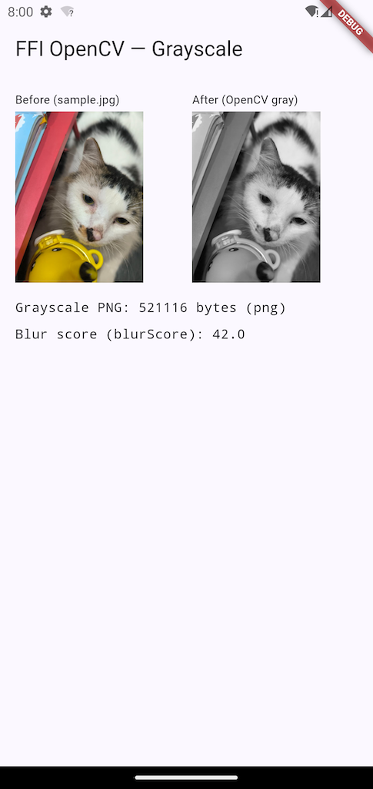

# flutter_ffi_opencv

Flutter ↔ OpenCV over **hand-written `dart:ffi`**, behind a clean layered architecture with a **provable native boundary**.

The point of this repo is the native boundary done correctly — memory ownership, isolate offloading, and the confinement of `dart:ffi` to a known surface — not "an app that converts an image to grayscale." Grayscale is just the operation that exercises the pipe end to end.

> Scope: Android (arm64) only at present. iOS is designed-for (the loader seam exists) but not yet build-wired. See [Current scope](#current-scope--roadmap).



---

## Two executable proofs

The architectural claims here are not prose — a reviewer can run them.

### 1. The `dart:ffi` boundary is enforced, not asserted

`dart:ffi` is imported in **exactly two locations**: `lib/core/native/` and the single FFI data source `lib/features/image_processing/data/datasources/opencv_ffi_datasource.dart`. Domain, repository, and presentation never see a `Pointer`. A one-command CI check fails the build if that ever leaks:

```bash
$ bash tool/check_ffi_boundary.sh
✅ dart:ffi is confined to core/native/ and the FFI data source.
```

The script greps for the `import 'dart:ffi'` **directive** (not the bare string, so comments documenting the rule don't trip it) and fails if any file outside the two allowed locations imports it.

### 2. Everything above the boundary is tested with no device and no `.so`

Because `dart:ffi` is confined, the entire error-mapping and `Either` plumbing is unit-testable on the Dart VM. The data source's abstract interface is mocked (mocktail); no emulator, no native library:

```bash
$ flutter test
00:00 +0: toGrayscale (image path) maps datasource bytes -> Right(ProcessedImage)
00:00 +1: toGrayscale (image path) OpenCvException(-1) -> DecodeFailure
00:00 +2: toGrayscale (image path) OpenCvException(-2) -> InvalidInputFailure
   ...
00:00 +11: All tests passed!
```

This **unit-vs-integration split is the payoff** of confining `dart:ffi`: the logic (status→`Failure` mapping, `Either` folding, both return shapes) is verified device-free; only the FFI *mechanism* itself needs a device.

---

## Architecture

Standard Clean Architecture layering, with the FFI boundary made explicit. `Uint8List` (pure `dart:typed_data`, no native lifetime) is allowed everywhere; `Pointer`/`dart:ffi` is not.

```
presentation/   GrayscalePage · GrayscaleController / BlurScoreController
                (AsyncNotifier folds Either -> AsyncValue.when)
      │ watches
providers/      Provider DI chain, typed to ABSTRACT interfaces
      │
domain/         ProcessedImage · ImageMetric          (Equatable, pure Dart)
                ImageProcessingRepository              (abstract interface)
                ConvertToGrayscale · ComputeBlurScore  (UseCase<T, Params>)
      │ Either<Failure, T>
data/           ImageProcessingRepositoryImpl
                (maps OpenCvException.status -> Failure)            ── no dart:ffi
      │ throws OpenCvException
══════════════ dart:ffi BOUNDARY — enforced by tool/check_ffi_boundary.sh ══════════════
data/datasources/  OpenCvFfiDataSource    Isolate.run + malloc/free + the native call
core/native/       OpenCvBindings (DynamicLibrary loader) · OpenCvResult (Struct)
                   OpenCvStatus (pure-Dart status mirror, no ffi)
      │ FFI
native (C++)    libnative_opencv.so   opencv_process() / opencv_free_buffer()  ->  OpenCV
```

Actual folder structure under `lib/`:

```
core/
  error/      failures.dart · failure_codes.dart · exceptions.dart
  native/     opencv_native.dart · opencv_result.dart · opencv_status.dart   ← ffi boundary (1 of 2)
  usecases/   usecase.dart
features/image_processing/
  data/
    datasources/    opencv_ffi_datasource.dart                               ← ffi boundary (2 of 2)
    models/         processed_image_model.dart
    repositories/   image_processing_repository_impl.dart
  domain/
    entities/       processed_image.dart · image_metric.dart
    repositories/   image_processing_repository.dart
    usecases/       convert_to_grayscale.dart · compute_blur_score.dart · image_bytes_params.dart
  providers/        image_processing_providers.dart
  presentation/
    pages/          grayscale_page.dart
    providers/      grayscale_controller.dart · blur_score_controller.dart
main.dart
```

- **Failures** are a `sealed` Equatable hierarchy with an optional machine-readable `code` (`FailureCode`); results flow as `Either<Failure, T>` (fpdart). State is exposed via Riverpod `AsyncNotifier`s that fold the `Either`. Manual `Equatable`, no freezed, no code generation.

---

## The native boundary design

The parts a reviewer cares about — each is reflected directly in `android/app/src/main/cpp/native_opencv.h` and `lib/core/native/` + the data source.

**Out-pointer result, not struct-by-value.** `opencv_process` returns an `int32` status and writes its payload into a **caller-owned** `OpenCvResult*`:

```c
int32_t opencv_process(const uint8_t* input, int32_t input_len,
                       int32_t op_code, OpenCvResult* out);
void    opencv_free_buffer(uint8_t* data);
```

Returning a mixed `int/pointer/double` struct *by value* is the fragile AArch64 ABI corner where register-vs-memory return classification is subtle; a misclassification is silent on-device corruption, not a compile error. The out-pointer (a primitive `int32` return + a caller-owned struct) sidesteps the entire question.

**Whoever allocates, frees.** Two allocators are in play (Dart's `malloc` and C++'s allocator) and they are never crossed:

- Dart allocates the **input buffer** and the **`OpenCvResult` struct**, and frees both in a `try/finally` on every path.
- C++ allocates **`out->data`**; Dart copies the bytes into a Dart-owned `Uint8List`, then calls **`opencv_free_buffer`** so the C++ allocator frees what it allocated.

**Single entrypoint + `op_code`, carrying two return shapes through one mechanism.** Image ops fill `data`/`data_len`; scalar ops fill `scalar` and leave `data == NULL`. The struct has **no `status` field** — the return value is the single source of truth, so it can't drift. Grayscale returns an image buffer; blur score returns a `double` — same plumbing, one switch.

**Isolate offloading with a hard boundary.** Each call runs the native work in `Isolate.run`. A `Pointer` or `DynamicLibrary` handle **cannot cross an isolate boundary** — only transferable Dart values do. The worker closure is given a plain `Uint8List` + `int op_code`; *inside* the worker it opens the library, allocates, calls, copies the result into a `Uint8List`/`double`, and frees everything before returning. The worker functions are **top-level** (not instance methods), so `this` can't be captured even by accident — the no-handle-crosses guarantee is structural, not a matter of discipline. Per-call offload is accepted because the operations are user-initiated and infrequent; the method signature is the seam for a persistent worker later.

**Hand-written bindings, not ffigen.** The contract is two symbols and one struct. Hand-writing the `lookupFunction` typedefs keeps the actual binding visible in the repo and removes the ffigen + libclang toolchain step for zero benefit at this size. (ffigen would earn its place on a large or churning header.)

**Status → `Failure` mapping** (in `ImageProcessingRepositoryImpl`, above the boundary):

| native / Dart-side status | `Failure` |
|---|---|
| `-1` decode | `DecodeFailure` |
| `-2` invalid input | `InvalidInputFailure` |
| `-3` encode | `EncodeFailure` |
| `-4` unknown op | `UnsupportedOperationFailure` |
| `-99` native exception | `NativeFailure` |
| `-100` malloc failed *(Dart-side)* | `MemoryFailure` |
| `-101` OK-but-null-data *(Dart-side)* | `NativeFailure` |

The native side wraps all `cv::` calls in `try/catch` so an OpenCV exception becomes a status code and never unwinds across the FFI boundary.

---

## Build & run (Android, arm64)

Requires the Flutter SDK (Dart ≥ 3.12) and the Android toolchain (SDK + NDK).

### Provision the OpenCV Android SDK (not committed)

The OpenCV Android SDK is hundreds of MB and is **gitignored** (`third_party/opencv-android-sdk/`). Provide it one of three ways — the CMake build resolves `OPENCV_DIR` in this order:

1. **`-DOPENCV_DIR=<sdk>/sdk/native/jni`** passed explicitly, else
2. the **`OPENCV_DIR` environment variable**, else
3. the **in-repo default**: `third_party/opencv-android-sdk/sdk/native/jni`.

The simplest path is the default: download the OpenCV Android SDK (tested with **4.12.0**) from [opencv.org/releases](https://opencv.org/releases/) and unpack it so that this file exists:

```
third_party/opencv-android-sdk/sdk/native/jni/OpenCVConfig.cmake
```

If the SDK is missing, CMake fails loudly with the exact path it tried (not a generic `find_package` error).

### Run

```bash
flutter pub get
flutter run                 # on a connected arm64 device or emulator
```

What the build does (see `android/app/src/main/cpp/CMakeLists.txt` and `android/app/build.gradle.kts`):

- Gradle passes `-DWITH_OPENCV=ON`; the native library `libnative_opencv.so` is built via CMake.
- OpenCV is linked **statically**, only `core`, `imgproc`, `imgcodecs` (not `libopencv_java4.so`), with `-ffunction-sections`/`-fdata-sections` + `--gc-sections` dead-stripping.
- ABI is **arm64-v8a only** (covers physical arm64 devices and Apple-Silicon emulators), filtered at both the CMake build and the APK packaging steps.

A bundled `assets/sample.jpg` is the input image for the demo screen.

---

## Testing

The split is deliberate and is the architectural selling point:

- **Unit (`flutter test`, no device, no `.so`):** `test/features/image_processing/data/repositories/image_processing_repository_impl_test.dart` mocks the `OpenCvDataSource` interface and asserts every `OpenCvException.status` maps to the correct `Failure`, and that success maps to `Right(ProcessedImage)` / `Right(ImageMetric)` — both return shapes. This is everything *above* the boundary.
- **Integration (device-only):** the FFI round-trip itself (real `.so`, real `malloc`/copy/free) — see [roadmap](#current-scope--roadmap).

The boundary check is a one-liner suitable for CI:

```bash
bash tool/check_ffi_boundary.sh
```

---

## Current scope & roadmap

Honest status — what is real, what is wired-but-stubbed, what is pending:

- ✅ **Grayscale is real.** `OP_GRAYSCALE` runs `cv::imdecode` → `cv::cvtColor(BGR2GRAY)` → `cv::imencode(".png")` in C++ and returns the encoded PNG across FFI.
- 🟡 **Blur score is wired end-to-end but the native op is stubbed.** `ComputeBlurScore` flows through every layer and renders a `double`, but `OP_BLUR_SCORE` currently returns a hardcoded `42.0`. It exists to prove the architecture carries the **scalar return shape** alongside the image shape; the real Laplacian-variance implementation is the next slice (a C++-only change behind the same contract).
- 🟡 **iOS is designed-for, not wired.** The loader (`lib/core/native/opencv_native.dart`) already branches to `DynamicLibrary.process()` for iOS; the CMake → `.framework`/static build is not yet done, so iOS will not build today.
- ⬜ **Pending:** the on-device integration test (`integration_test/`), an image picker (the demo uses a bundled asset), and OpenCV binary-size trimming (custom `BUILD_LIST`).

---

## Stack

Flutter · Dart `dart:ffi` (hand-written) · OpenCV (C++, static) · Riverpod (`AsyncNotifier`) · fpdart (`Either`) · Equatable · mocktail. No freezed, no code generation.
